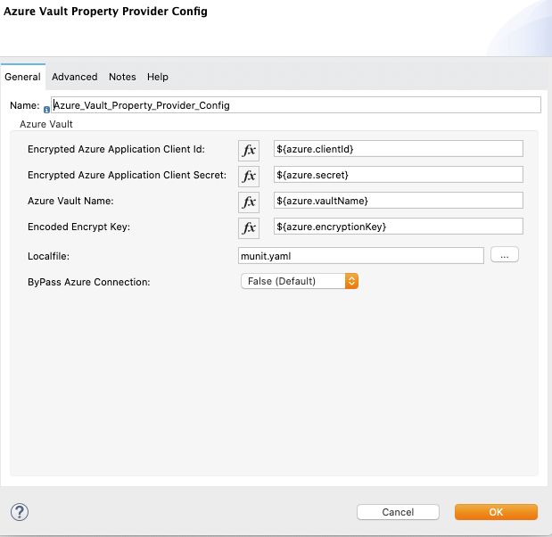

# Azure Vault Property Provider for Properties Override for Mule 4

This module will be used to override properties during deployment. This will work in tandem with
- properties placeholder
- secure properties placeholder

## Deploying to Exchange
Clone the project to your local, change the groupId to point your orgId. Issue `mvn deploy`.
Ensure that there is an entry in your settings.xml pertaining to Exchange2

## Local Install
For local install, give any groupId. Issue `mvn clean install -DskipTests`

## Using the module in a Mule4 Project
Add this dependency to your application pom.xml

```
<dependency>
	<groupId>${groupId}</groupId>
	<artifactId>mule-azure-vault-properties-providers-module</artifactId>
	<version>${version}</version>
	<classifier>mule-plugin</classifier>
</dependency>
```

## Configuration


### Azure Application ClientId and Azure Application Secret Key
These should be provided as part of the wrapper.conf or during deployment.
These can be provided through secure properties also.

### Azure Vault Name
The vault name should be provided against which Mule will fetch keys from
Azure Vault Key Store.


### Example Config
A sample config.
```
	<azure-vault-property-provider:config
	    name="Azure_Vault_Property_Provider_Config"
	    doc:name="Azure Vault Property Provider Config"
	    doc:id="41572f12-9652-437e-82c7-4e7d642fca49" >
		<azure-vault-property-provider:azure-vault
		    applicationClientId="${azure.app.clientId}"
		    applicationSecretKey="${azure.app.clientSecret}"
		    azureVaultName="${azure.vaultName}" />
	</azure-vault-property-provider:config>
```



## Usage

### Prefix
- For all purposes, this module relies on **azure-vault** as the prefix.
- Any property provided as **${azure-vault::}** will be referenced from Azure Vault Key Store.

### Azure value can store 'n' number of  properties
- There can be `n` number of secrets in Azure Vault key store. The best way to access a particular key
`${azure-vault::key}`

### Example Usage

```
<set-variable
    value="${azure-vault::secretProperty1}"
    doc:name="Set Variable" doc:id="045a2583-411a-46fd-9352-60c64887970c"
    variableName="azureProperty1"/>

```

## Contributors
 Srinivasan Raghunathan
